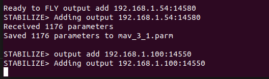

Each SITL instance must have unique parameters: -I, --use-dir.
For i_th drone, commands will be

```
sim_vehicle.py -I 0 --use-dir 0
```

After SITL starting, we can set parameters of MAVProxy

```
set param 
```

## Notes:

- By default, UDP Port Number of MAVProxy will increase 10 when create a new instance. E.g: With first instance, default port is 14550, with second one, default port is 14560 ....
- Seems like that GCS Softwares on Windows is better than on Linux, so we should use MAVproxy to redirect control stream to a Windows PC. E.g:

```
output add 192.168.1.54:14550
```


